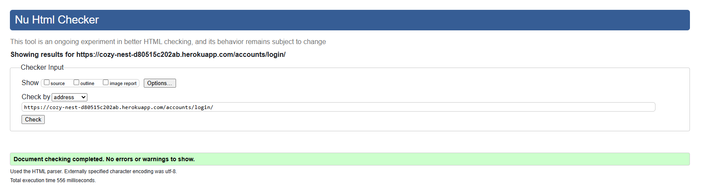
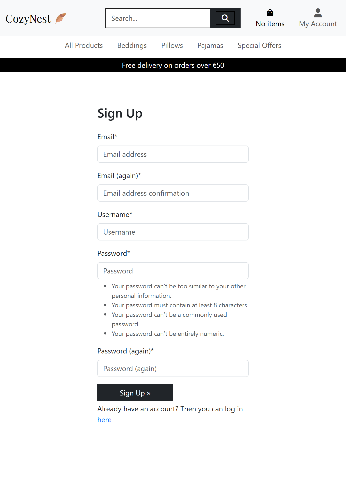
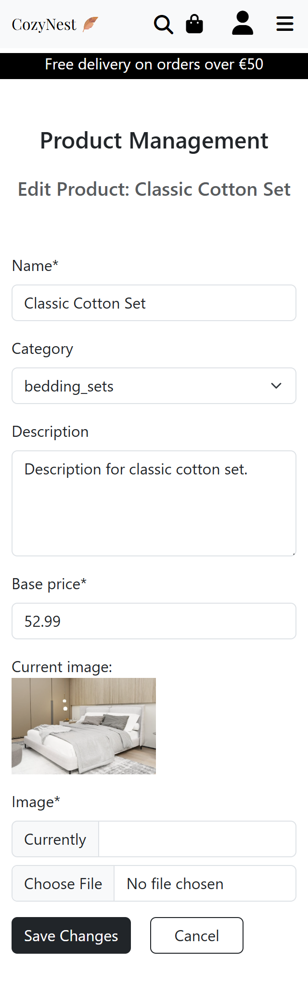
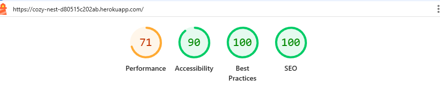
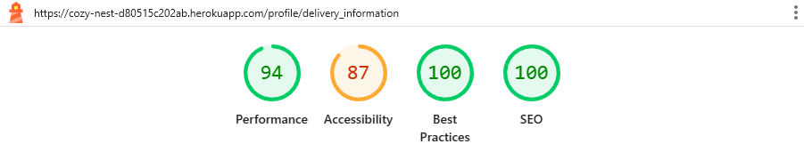
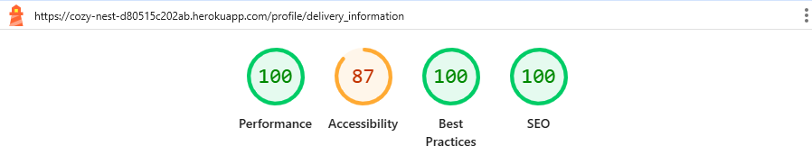
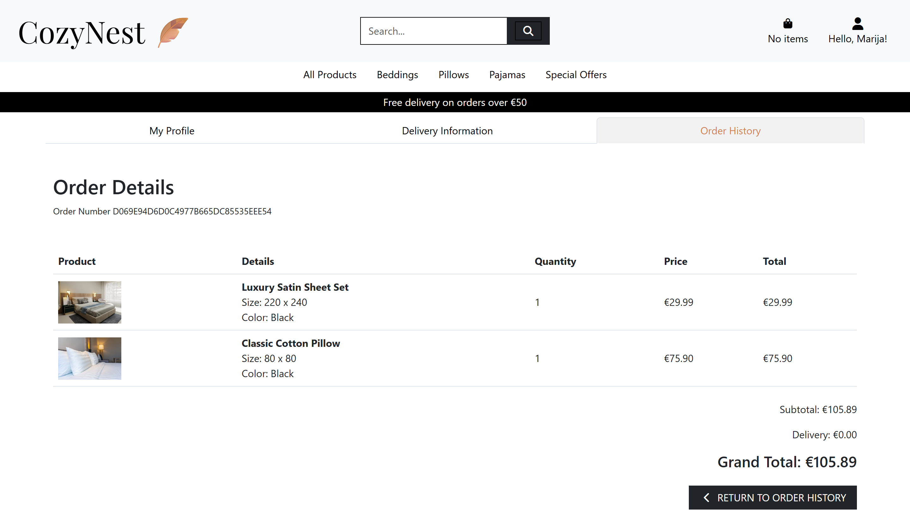

# Testing

> [!NOTE]  
> Return back to the [README.md](README.md) file.

## Code Validation

### HTML

I have used the recommended [HTML W3C Validator](https://validator.w3.org) to validate all of my HTML files.

| Directory | File | URL | Screenshot | Notes |
| --- | --- | --- | --- | --- |
| bag | [bag.html](https://github.com/marijavelickovska/cozynest/blob/main/bag/templates/bag/bag.html) | [Link](https://validator.w3.org/nu/?doc=https://cozy-nest-d80515c202ab.herokuapp.com/bag/&out=html) |  | |
| checkout | [checkout.html](https://github.com/marijavelickovska/cozynest/blob/main/checkout/templates/checkout/checkout.html) ||  | |
| checkout | [checkout_success.html](https://github.com/marijavelickovska/cozynest/blob/main/checkout/templates/checkout/checkout_success.html) | |  | |
| home | [about_us.html](https://github.com/marijavelickovska/cozynest/blob/main/home/templates/home/about_us.html) | [Link](https://validator.w3.org/nu/?doc=https://cozy-nest-d80515c202ab.herokuapp.com/about_us&out=html) |  | |
| home | [careers.html](https://github.com/marijavelickovska/cozynest/blob/main/home/templates/home/careers.html) | [Link](https://validator.w3.org/nu/?doc=https://cozy-nest-d80515c202ab.herokuapp.com/careers&out=html) |  | |
| home | [contact_us.html](https://github.com/marijavelickovska/cozynest/blob/main/home/templates/home/contact_us.html) | [Link](https://validator.w3.org/nu/?doc=https://cozy-nest-d80515c202ab.herokuapp.com/contact_us&out=html) |  | |
| home | [footer.html](https://github.com/marijavelickovska/cozynest/blob/main/home/templates/home/footer.html) | |  | |
| home | [home.html](https://github.com/marijavelickovska/cozynest/blob/main/home/templates/home/home.html) | [Link](https://validator.w3.org/nu/?doc=https://cozy-nest-d80515c202ab.herokuapp.com/&out=html) |  | Validating HTML with a semantic `<section>` element, the validator warns about lacking a header `h2-h6`. This is acceptable. |
| home | [our_team.html](https://github.com/marijavelickovska/cozynest/blob/main/home/templates/home/our_team.html) | [Link](https://validator.w3.org/nu/?doc=https://cozy-nest-d80515c202ab.herokuapp.com/our_team&out=html) |  | |
| products | [add_product.html](https://github.com/marijavelickovska/cozynest/blob/main/products/templates/products/add_product.html) | |  | |
| products | [add_product_variant.html](https://github.com/marijavelickovska/cozynest/blob/main/products/templates/products/add_product_variant.html) | |  |  |
| products | [all_product_variants.html](https://github.com/marijavelickovska/cozynest/blob/main/products/templates/products/all_product_variants.html) | |  | |
| products | [edit_product.html](https://github.com/marijavelickovska/cozynest/blob/main/products/templates/products/edit_product.html) | |  | |
| products | [edit_product_variant.html](https://github.com/marijavelickovska/cozynest/blob/main/products/templates/products/edit_product_variant.html) |  |  | |
| products | [product_detail.html](https://github.com/marijavelickovska/cozynest/blob/main/products/templates/products/product_detail.html) | |  | |
| products | [product_managment.html](https://github.com/marijavelickovska/cozynest/blob/main/products/templates/products/product_managment.html) | |  | |
| products | [products.html](https://github.com/marijavelickovska/cozynest/blob/main/products/templates/products/products.html) | [Link](https://validator.w3.org/nu/?doc=https://cozy-nest-d80515c202ab.herokuapp.com/products/?sort=price&direction=asc&out=html) |  ||
| profiles | [delivery_information.html](https://github.com/marijavelickovska/cozynest/blob/main/profiles/templates/profiles/delivery_information.html) | [Link](https://validator.w3.org/nu/?doc=https%3A%2F%2Fcozy-nest-d80515c202ab.herokuapp.com%2Faccounts%2Flogin%2F%3Fnext%3D%2Fprofile%2Fdelivery_information) |  | |
| profiles | [order_detail.html](https://github.com/marijavelickovska/cozynest/blob/main/profiles/templates/profiles/order_detail.html) | [Link](https://validator.w3.org/nu/?doc=https%3A%2F%2Fcozy-nest-d80515c202ab.herokuapp.com%2Faccounts%2Flogin%2F%3Fnext%3D%2Fprofile%2Forder_detail%2FB471B657B9E448B1A28CB23CD6F42FD2%2F) |  | |
| profiles | [order_history.html](https://github.com/marijavelickovska/cozynest/blob/main/profiles/templates/profiles/order_history.html) | [Link](https://validator.w3.org/nu/?doc=https%3A%2F%2Fcozy-nest-d80515c202ab.herokuapp.com%2Faccounts%2Flogin%2F%3Fnext%3D%2Fprofile%2Forder_history) |  | |
| profiles | [profile.html](https://github.com/marijavelickovska/cozynest/blob/main/profiles/templates/profiles/profile.html) | |  | |
| templates | [404.html](https://github.com/marijavelickovska/cozynest/blob/main/templates/errors/404.html) |  |  |  |  | |
| templates | [login.html](https://github.com/marijavelickovska/cozynest/blob/main/templates/account/login.html) | [Link](https://validator.w3.org/nu/?doc=https://cozy-nest-d80515c202ab.herokuapp.com/accounts/login/&out=html) |  | |
| templates | [logout.html](https://github.com/marijavelickovska/cozynest/blob/main/templates/account/logout.html) | [Link](https://validator.w3.org/nu/?doc=https%3A%2F%2Fcozy-nest-d80515c202ab.herokuapp.com%2F)|  | |
| templates | [signup.html](https://github.com/marijavelickovska/cozynest/blob/main/templates/account/signup.html) | [Link](https://validator.w3.org/nu/?doc=https://cozy-nest-d80515c202ab.herokuapp.com/accounts/signup/&out=html) |  | |

### CSS

I have used the recommended [CSS Jigsaw Validator](https://jigsaw.w3.org/css-validator) to validate all of my CSS files.

| Directory | File | URL | Screenshot | Notes |
| --- | --- | --- | --- | --- |
| products | [products.css](https://github.com/marijavelickovska/cozynest/blob/main/products/static/products/css/products.css) | |  | |
| profiles | [profile.css](https://github.com/marijavelickovska/cozynest/blob/main/profiles/static/profiles/css/profile.css) | |  | |
| static | [base.css](https://github.com/marijavelickovska/cozynest/blob/main/static/css/base.css) | |  | |

### JavaScript

I have used the recommended [JShint Validator](https://jshint.com) to validate all of my JS files.

| Directory | File | URL | Screenshot | Notes |
| --- | --- | --- | --- | --- |
| templates | [base.html](https://github.com/marijavelickovska/cozynest/blob/main/templates/base.html) |  |  | Validator shows warnings related to Bootstrap usage. These warnings are acceptable. |
| products | [products.html](https://github.com/marijavelickovska/cozynest/blob/main/products/templates/products/products.html) |  |  | |
| products | [product_detail.html](https://github.com/marijavelickovska/cozynest/blob/main/products/templates/products/product_detail.html) |  |  | |
| products | [add_product_variant.html](https://github.com/marijavelickovska/cozynest/blob/main/products/templates/products/add_product_variant.html) |  |  | |
| bag | [bag.html](https://github.com/marijavelickovska/cozynest/blob/main/bag/templates/bag/bag.html) |  |  | JSHint shows "unused variable" warnings for `max` and `min` in incrementQty/decrementQty functions because they are only called from HTML attributes. This is a false positive; code is correct and works as intended. |
| checkout | [checkout.html](https://github.com/marijavelickovska/cozynest/blob/main/checkout/templates/checkout/checkout.html) |  |  | Validator shows warnings related to Stripe usage. These warnings are acceptable. |

### Python

I have used the recommended [PEP8 CI Python Linter](https://pep8ci.herokuapp.com) to validate all of my Python files.

| Directory | File | URL | Screenshot | Notes |
| --- | --- | --- | --- | --- |
| bag | [admin.py](https://github.com/marijavelickovska/cozynest/blob/main/bag/admin.py) | [PEP8 CI Link](https://pep8ci.herokuapp.com/https:/https://raw.githubusercontent.com/marijavelickovska/cozynest/refs/heads/main/bag/admin.py) |  |  |
| bag | [context_processors.py](https://github.com/marijavelickovska/cozynest/blob/main/bag/context_processors.py) | [PEP8 CI Link](https://pep8ci.herokuapp.com/https://raw.githubusercontent.com/marijavelickovska/cozynest/main/bag/context_processors.py) |  |  |
| bag | [models.py](https://github.com/marijavelickovska/cozynest/blob/main/bag/models.py) | [PEP8 CI Link](https://pep8ci.herokuapp.com/https://raw.githubusercontent.com/marijavelickovska/cozynest/main/bag/models.py) |  |  |
| bag | [bag_tools.py](https://github.com/marijavelickovska/cozynest/blob/main/bag/templatetags/bag_tools.py) | [PEP8 CI Link](https://pep8ci.herokuapp.com/https://raw.githubusercontent.com/marijavelickovska/cozynest/main/bag/templatetags/bag_tools.py) |  |  |
| bag | [urls.py](https://github.com/marijavelickovska/cozynest/blob/main/bag/urls.py) | [PEP8 CI Link](https://pep8ci.herokuapp.com/https://raw.githubusercontent.com/marijavelickovska/cozynest/main/bag/urls.py) |  |  |
| bag | [views.py](https://github.com/marijavelickovska/cozynest/blob/main/bag/views.py) | [PEP8 CI Link](https://pep8ci.herokuapp.com/https://raw.githubusercontent.com/marijavelickovska/cozynest/main/bag/views.py) |  |  |
| checkout | [admin.py](https://github.com/marijavelickovska/cozynest/blob/main/checkout/admin.py) | [PEP8 CI Link](https://pep8ci.herokuapp.com/https://raw.githubusercontent.com/marijavelickovska/cozynest/main/checkout/admin.py) |  |  |
| checkout | [forms.py](https://github.com/marijavelickovska/cozynest/blob/main/checkout/forms.py) | [PEP8 CI Link](https://pep8ci.herokuapp.com/https://raw.githubusercontent.com/marijavelickovska/cozynest/main/checkout/forms.py) |  |  |
| checkout | [models.py](https://github.com/marijavelickovska/cozynest/blob/main/checkout/models.py) | [PEP8 CI Link](https://pep8ci.herokuapp.com/https://raw.githubusercontent.com/marijavelickovska/cozynest/main/checkout/models.py) |  |  |
| checkout | [signals.py](https://github.com/marijavelickovska/cozynest/blob/main/checkout/signals.py) | [PEP8 CI Link](https://pep8ci.herokuapp.com/https://raw.githubusercontent.com/marijavelickovska/cozynest/main/checkout/signals.py) |  |  |
| checkout | [urls.py](https://github.com/marijavelickovska/cozynest/blob/main/checkout/urls.py) | [PEP8 CI Link](https://pep8ci.herokuapp.com/https://raw.githubusercontent.com/marijavelickovska/cozynest/main/checkout/urls.py) |  |  |
| checkout | [views.py](https://github.com/marijavelickovska/cozynest/blob/main/checkout/views.py) | [PEP8 CI Link](https://pep8ci.herokuapp.com/https://raw.githubusercontent.com/marijavelickovska/cozynest/main/checkout/views.py) |  |  |
| cozynest | [settings.py](https://github.com/marijavelickovska/cozynest/blob/main/cozynest/settings.py) | [PEP8 CI Link](https://pep8ci.herokuapp.com/https://raw.githubusercontent.com/marijavelickovska/cozynest/main/cozynest/settings.py) |  |  |
| cozynest | [urls.py](https://github.com/marijavelickovska/cozynest/blob/main/cozynest/urls.py) | [PEP8 CI Link](https://pep8ci.herokuapp.com/https://raw.githubusercontent.com/marijavelickovska/cozynest/main/cozynest/urls.py) |  |  |
| cozynest | [views.py](https://github.com/marijavelickovska/cozynest/blob/main/cozynest/views.py) | [PEP8 CI Link](https://pep8ci.herokuapp.com/https://raw.githubusercontent.com/marijavelickovska/cozynest/main/cozynest/views.py) |  |  |
| home | [admin.py](https://github.com/marijavelickovska/cozynest/blob/main/home/admin.py) | [PEP8 CI Link](https://pep8ci.herokuapp.com/https://raw.githubusercontent.com/marijavelickovska/cozynest/main/home/admin.py) |  |  |
| home | [context_processors.py](https://github.com/marijavelickovska/cozynest/blob/main/home/context_processors.py) | [PEP8 CI Link](https://pep8ci.herokuapp.com/https://raw.githubusercontent.com/marijavelickovska/cozynest/main/home/context_processors.py) |  |  |
| home | [forms.py](https://github.com/marijavelickovska/cozynest/blob/main/home/forms.py) | [PEP8 CI Link](https://pep8ci.herokuapp.com/https://raw.githubusercontent.com/marijavelickovska/cozynest/main/home/forms.py) |  |  |
| home | [models.py](https://github.com/marijavelickovska/cozynest/blob/main/home/models.py) | [PEP8 CI Link](https://pep8ci.herokuapp.com/https://raw.githubusercontent.com/marijavelickovska/cozynest/main/home/models.py) |  |  |
| home | [urls.py](https://github.com/marijavelickovska/cozynest/blob/main/home/urls.py) | [PEP8 CI Link](https://pep8ci.herokuapp.com/https://raw.githubusercontent.com/marijavelickovska/cozynest/main/home/urls.py) |  |  |
| home | [views.py](https://github.com/marijavelickovska/cozynest/blob/main/home/views.py) | [PEP8 CI Link](https://pep8ci.herokuapp.com/https://raw.githubusercontent.com/marijavelickovska/cozynest/main/home/views.py) |  |  |
|  | [manage.py](https://github.com/marijavelickovska/cozynest/blob/main/manage.py) | [PEP8 CI Link](https://pep8ci.herokuapp.com/https://raw.githubusercontent.com/marijavelickovska/cozynest/main/manage.py) |  |  |
| products | [admin.py](https://github.com/marijavelickovska/cozynest/blob/main/products/admin.py) | [PEP8 CI Link](https://pep8ci.herokuapp.com/https://raw.githubusercontent.com/marijavelickovska/cozynest/main/products/admin.py) |  |  |
| products | [forms.py](https://github.com/marijavelickovska/cozynest/blob/main/products/forms.py) | [PEP8 CI Link](https://pep8ci.herokuapp.com/https://raw.githubusercontent.com/marijavelickovska/cozynest/main/products/forms.py) |  |  |
| products | [models.py](https://github.com/marijavelickovska/cozynest/blob/main/products/models.py) | [PEP8 CI Link](https://pep8ci.herokuapp.com/https://raw.githubusercontent.com/marijavelickovska/cozynest/main/products/models.py) |  |  |
| products | [test_forms.py](https://github.com/marijavelickovska/cozynest/blob/main/products/tests/test_forms.py) | [PEP8 CI Link](https://pep8ci.herokuapp.com/https://raw.githubusercontent.com/marijavelickovska/cozynest/main/products/tests/test_forms.py) |  |  |
| products | [test_views.py](https://github.com/marijavelickovska/cozynest/blob/main/products/tests/test_views.py) | [PEP8 CI Link](https://pep8ci.herokuapp.com/https://raw.githubusercontent.com/marijavelickovska/cozynest/main/products/tests/test_views.py) |  |  |
| products | [urls.py](https://github.com/marijavelickovska/cozynest/blob/main/products/urls.py) | [PEP8 CI Link](https://pep8ci.herokuapp.com/https://raw.githubusercontent.com/marijavelickovska/cozynest/main/products/urls.py) |  |  |
| products | [views.py](https://github.com/marijavelickovska/cozynest/blob/main/products/views.py) | [PEP8 CI Link](https://pep8ci.herokuapp.com/https://raw.githubusercontent.com/marijavelickovska/cozynest/main/products/views.py) |  |  |
| profiles | [forms.py](https://github.com/marijavelickovska/cozynest/blob/main/profiles/forms.py) | [PEP8 CI Link](https://pep8ci.herokuapp.com/https://raw.githubusercontent.com/marijavelickovska/cozynest/main/profiles/forms.py) |  |  |
| profiles | [models.py](https://github.com/marijavelickovska/cozynest/blob/main/profiles/models.py) | [PEP8 CI Link](https://pep8ci.herokuapp.com/https://raw.githubusercontent.com/marijavelickovska/cozynest/main/profiles/models.py) |  |  |
| profiles | [signals.py](https://github.com/marijavelickovska/cozynest/blob/main/profiles/signals.py) | [PEP8 CI Link](https://pep8ci.herokuapp.com/https://raw.githubusercontent.com/marijavelickovska/cozynest/main/profiles/signals.py) |  |  |
| profiles | [test_views.py](https://github.com/marijavelickovska/cozynest/blob/main/profiles/tests/test_views.py) | [PEP8 CI Link](https://pep8ci.herokuapp.com/https://raw.githubusercontent.com/marijavelickovska/cozynest/main/profiles/tests/test_views.py) |  |  |
| profiles | [urls.py](https://github.com/marijavelickovska/cozynest/blob/main/profiles/urls.py) | [PEP8 CI Link](https://pep8ci.herokuapp.com/https://raw.githubusercontent.com/marijavelickovska/cozynest/main/profiles/urls.py) |  |  |
| profiles | [views.py](https://github.com/marijavelickovska/cozynest/blob/main/profiles/views.py) | [PEP8 CI Link](https://pep8ci.herokuapp.com/https://raw.githubusercontent.com/marijavelickovska/cozynest/main/profiles/views.py) |  |  |

## Responsiveness

I've tested my deployed project to check for responsiveness issues.

| Page | Mobile | Tablet | Desktop | Notes |
| --- | --- | --- | --- | --- |
| Home |  |  |  | Works as expected |
| About Us |  |  |  | Works as expected |
| Our Team |  |  |  | Works as expected |
| Contact Us |  |  |  | Works as expected |
| Careers |  |  |  | Works as expected |
| Register |  |  |  | Works as expected |
| Login |  |  |  | Works as expected |
| Products |  |  |  | Works as expected |
| Product Details |  |  |  | Works as expected |
| Bag |  |  |  | Works as expected |
| Checkout |  |  |  | Works as expected |
| Checkout Success |  |  |  | Works as expected |
| Profile |  |  |  | Works as expected |
| Profile - Delivery Information |  |  |  | Works as expected |
| Profile - Order History |  |  |  | Works as expected |
| Profile - Order Detail |  |  |  | Works as expected |
| Product Managment - Add Product |  |  |  | Works as expected |
| Product Managment - Add Product Variant |  |  |  | Works as expected |
| Product Managment - All Product Variants |  |  |  | Works as expected |
| Product Managment - Edit Product |  |  |  | Works as expected |
| Product Managment - Edit Product Variant |  |  |  | Works as expected |
| 404 |  |  |  | Works as expected |

## Browser Compatibility

I've tested my deployed project on multiple browsers to check for compatibility issues.

| Page | Chrome | Firefox | Edge | Notes |
| --- | --- | --- | --- | --- |
| Home |  |  |  | Works as expected |
| About Us |  |  |  | Works as expected |
| Our Team |  |  |  | Works as expected |
| Contact Us |  |  |  | Works as expected |
| Careers |  |  |  | Works as expected |
| Register |  |  |  | Works as expected |
| Login |  |  |  | Works as expected |
| Products |  |  |  | Works as expected |
| Product Details |  |  |  | Works as expected |
| Bag |  |  |  | Works as expected |
| Checkout |  |  |  | Works as expected |
| Checkout Success |  |  |  | Works as expected |
| Profile |  |  |  | Works as expected |
| Profile - Delivery Information |  |  |  | Works as expected |
| Profile - Order History |  |  |  | Works as expected |
| Profile - Order Detail |  |  |  | Works as expected |
| Product Managment - Add Product |  |  |  | Works as expected |
| Product Managment - Add Product Variant |  |  |  | Works as expected |
| Product Managment - All Product Variants |  |  |  | Works as expected |
| Product Managment - Edit Product |  |  |  | Works as expected |
| Product Managment - Edit Product Variant |  |  |  | Works as expected |
| 404 |  |  |  | Works as expected |

## Lighthouse Audit

I've tested my deployed project using the Lighthouse Audit tool to check for any major issues. Some warnings are outside of my control, and mobile results tend to be lower than desktop.

| Page | Mobile | Desktop |
| --- | --- | --- |
| Home |  |  |
| About Us |  |  |
| Our Team |  |  |
| Contact Us |  |  |
| Careers |  |  |
| Register |  |  |
| Login |  |  |
| Products |  |  |
| Product Details |  |  |
| Bag |  |  |
| Checkout |  |  |
| Checkout Success |  |  |
| Profile |  |  |
| Profile - Delivery Information |  |  |
| Profile - Order History |  |  |
| Profile - Order Detail|  |  |
| Product Managment - Add Product |  |  |
| Product Managment - Add Product Variant|  |  |
| Product Managment - All Product Variants |  |  |
| Product Managment - Edit Product |  |  |
| Product Managment - Edit Product Variant |  |  |
| 404 |  |  |

## Defensive Programming

Defensive programming was manually tested with the below user acceptance testing:

| Page | Expectation | Test | Result | Screenshot |
| --- | --- | --- | --- | --- |
| Products | Feature is expected to allow users to browse products without registration. | Opened product pages as a guest user. | Products were fully accessible without requiring registration. |  |
| | Feature is expected to sort products by price, rating and name. | Tested sorting options for price (low-to-high/high-to-low), rating (low-to-high/high-to-low) and name (alphabetical). | Sorting worked correctly for all options. |  |
| | Feature is expected to filter products by category. | Applied category filters while browsing products. | Filters worked as expected, displaying only relevant products. |  |
| | Feature is expected to show detailed product information. | Clicked on individual products to view details. | Product details (name, price, category, rating, description and image) were displayed correctly. |  |
| Shopping Cart | Feature is expected to allow customers to add items to the cart with quantity controls. | Added products to the cart and adjusted quantities. | Items were added successfully, and quantities updated as expected. |  |
| | Feature is expected to allow customers to view and manage their cart. | Opened the cart page and edited cart contents. | Cart contents were displayed, updated, and removed correctly. |  |
| Checkout | Feature is expected to display cart items, grand total, and input fields for checkout. | Proceeded to checkout with items in the cart. | Checkout page displayed cart items, total, and input fields as expected. |  |
| | Feature is expected to allow secure payment via Stripe. | Entered valid card details using Stripe at checkout. | Payment was processed securely, and an order confirmation page was displayed. |  |
| | Feature is expected to send a confirmation email after purchase. | Completed a purchase and checked email inbox. | Confirmation email was received with order details. |  |
| | Feature is expected to display an order confirmation page with an order number. | Completed a purchase. | Order confirmation page displayed successfully with an order number. |  |
| Account Management | Feature is expected to allow logged-in users to view their account information and update it if desired. | Logged in as a registered user, accessed the account page, updated profile details (name, email, full name), and saved changes. | Account information was displayed correctly and updates were saved successfully. |  |
| | Feature is expected to remember the shipping address for returning customers. | Completed multiple checkouts as a returning customer. | Shipping address was pre-filled on subsequent purchases. |  |
|  | Feature is expected to allow logged-in users to view past orders. | Logged in as a returning customer and accessed order history. | Past orders were displayed correctly in the account section. |  |
| | Feature is expected to allow a logged-in user to click on an order number in their order history and view the order details for that specific order. | Logged in as a registered user, accessed order history, clicked on an order number to open its details. | The order details were displayed correctly, showing order number, line items details, quantity, price and totals. |  |
| Admin Features | Feature is expected to allow the site owner to create new products. | Created new products with valid data (name, price, description, image, category). | Products were added successfully and displayed on the site. |  |
| | Feature is expected to allow the site owner to update product details. | Edited product details as an admin user. | Product updates were saved and displayed correctly. |  |
| | Feature is expected to allow the site owner to delete products. | Deleted a product from the inventory. | Product was removed successfully from the site, after being prompted to confirm first. |  |
| | Feature is expected to allow the site owner to create new product variants. | Created new product variant with valid data (product name, size, color, price, stock and image). | Product variant was added successfully and displayed on the site. |  |
| | Feature is expected to allow the site owner to update product details. | Edited product details as an admin user. | Product updates were saved and displayed correctly. |  |
| | Feature is expected to allow the site owner to view all product variants. | Logged in as the site owner/admin, accessed the product variants page. | All product variants were displayed correctly, showing product name, size, color, stock and price. |  |
| | Feature is expected to allow the site owner to update product variant details. | Edited product variant details as an admin user. | Product updates were saved and displayed correctly. |  |
| | Feature is expected to allow the site owner to delete product variants. | Deleted a product variant from the inventory. | Product variant was removed successfully from the site, after being prompted to confirm first. |  |
| Contact Page | Feature is expected to allow users to send messages through the contact form. | Filled out the contact form as a user, submitted a message. | Message was successfully sent and confirmation was displayed. |  |
| 404 Error Page | Feature is expected to display a 404 error page for non-existent pages. | Navigated to an invalid URL (e.g., `/test`). | A custom 404 error page was displayed as expected. |  |

## User Story Testing

| Target | Expectation | Outcome | Screenshot |
| --- | --- | --- | --- |
| As a user | I want to immediately understand what the website offers when I land on the homepage | so that I know the purpose of the site and what products or services I can expect. |  |
| As a user | I want to have a search bar and filters | so that I can easily search and browse through the available products. |  |
| As a user | I want to see the website’s contact information | so that I can get in touch if I have any questions or issues. |  |
| As a user | I want to see the Facebook page and subscribe to the newsletter | so that I can stay updated with news, offers and promotions. |  |
| As a user | I want to shop easily on both mobile and desktop devices | so that I have a smooth experience regardless of the device I'm using. |  |
| As a user | I want to add products to the shopping bag without registering | so that I can shop more easily and decide later if I want to create an account. |  |
| As a user | I want to register and create a profile on the website | so that I can manage my personal information, view order history, and save preferences. |  |
| As a user | I want to add products to the shopping cart and have them saved | so that I can view my selected items later before deciding to place an order. |  |
| As a user | I want to add, remove, and change the quantity of products in my shopping cart | so that I can customize my order before checkout. |  |
| As a user | I want to save my delivery information during checkout | so that I don’t have to re-enter it every time I place an order. |  |
| As a user |  I want to view my order history in my profile | so that I can track my past purchases. |  |
| As a user | I want to choose from multiple product variants such as sizes or colors | so that I can buy the exact version of the product I want. |  |
| As a user | I want to receive messages for all my actions | so that I am informed about important events like login, adding/removing products from the cart, updating quantities, successful orders, and profile changes. |  |
| As a user | I want to see a success page and receive a confirmation email after completing an order | so that I know my order was successfully placed and can reference it with the order number. |  |
| As a owner |  I want to add new products, edit existing ones, and delete products | so that I can keep the online store’s catalog up to date. |  |

## Automated Testing

I have conducted a series of automated tests on my application.

> [!NOTE]  
> I fully acknowledge and understand that, in a real-world scenario, an extensive set of additional tests would be more comprehensive.

### Python (Unit Testing)

I have used Django's built-in unit testing framework to test the application functionality. In order to run the tests, I ran the following commands in the terminal each time:

- `python manage.py test products.tests.test_forms`
- `python manage.py test products.tests.test_views`
- `python manage.py test profiles.tests.test_views`

To create the coverage report, I would then run the following commands:

- `pip3 install coverage`
- `pip3 freeze --local > requirements.txt`
- `coverage run --omit="*/site-packages/*,*/migrations/*,*/__init__.py,env.py,.env" manage.py test`
- `coverage report`

To see the HTML version of the reports, and find out whether some pieces of code were missing, I ran the following commands:

- `coverage html`
- `python3 -m http.server`

Below are the results from the full coverage report on my application that I've tested:

## Bugs

### Fixed Bugs

I've used [GitHub Issues](https://www.github.com/marijavelickovska/cozynest/issues) to track and manage bugs and issues during the development stages of my project.

All previously closed/fixed bugs can be tracked [here](https://www.github.com/marijavelickovska/cozynest/issues?q=is%3Aissue+is%3Aclosed+label%3Abug).

### Unfixed Bugs

Any remaining open issues can be tracked [here](https://www.github.com/marijavelickovska/cozynest/issues?q=is%3Aissue+is%3Aopen+label%3Abug).

### Known Issues

> [!IMPORTANT]  
> There are no remaining bugs that I am aware of, though, even after thorough testing, I cannot rule out the possibility.

### Other Findings

> Product prices are manually set using fixtures without strict association to specific products or sizes. 
  As a result, some prices may appear inconsistent. These values are intended only for testing purposes.

> The links under "Special Offers" in the navbar currently do not lead to any products. This layout was kept for visual purposes, as it makes the navbar look nicer. Functionality for these links is planned for future implementation.

